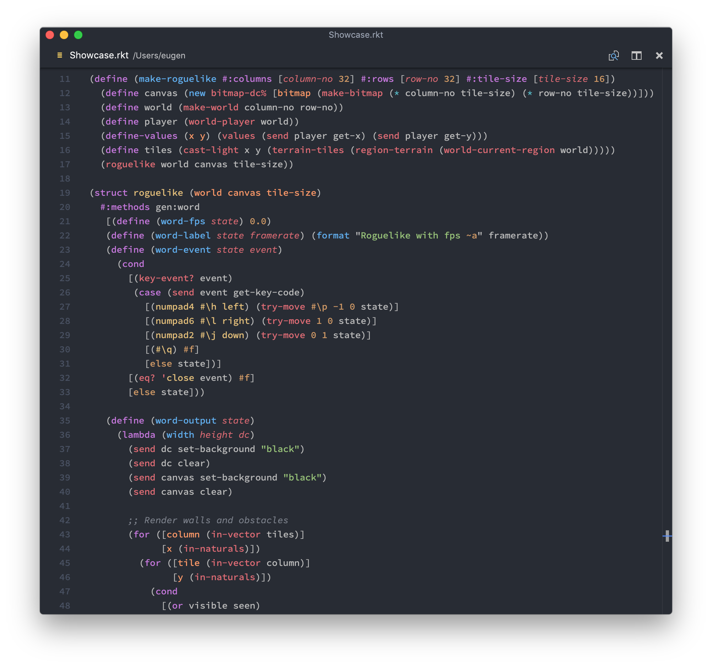

# Racket for Visual Studio Code

This package adds support for [Racket](racket-lang.org) to Visual Studio Code. It focuses on providing
top-quality syntax highlighting with full support of semantic scoping.
The syntax highlighting currently supports:

- quotes and quasiquotes
- function and variable definition
- Racket keywords (such as `cond`, `case` etc.)
- special Racket syntax for binding a value to an identifier (such as inside `for` clauses)
- numbers, including numbers in exponential form and complex numbers
- vectors and hash tables
- and many more — every common (and also not so common) Racket expression should be correctly hightlighted

## Syntax Highlighting

Racket for VS Code is built to match the quality of Racket editing in VS Code with other editors,
such as emacs and Vim. The syntax highlighting is one of the best of its kind; you can see a little preview
here:

_The screenshot was taken with a customized Atom One Dark theme and the awesome Source Code Pro font._

We recommend our users to take a look at [Kary Pro Colors][1], which is a theme developed specifically
to support various semantic scopes and which will get dedicated Racket support soon.

## Other features

This package also features a simple extension to IntelliSense to support Racket's "kebab" identifiers
and also various Racket names such as `string->keyword` or `#lang`. Other IDE-like features are
being worked on.

## Issues

Syntax highlighting as a whole has two inseparable parts:

- the grammar, which this extension provides, that "parses" the code and decides what text represents what
- the theme, which then colorizes the _what_ based on what it is

If you have some troubles with the syntax highlighting, try to find out if it's a problem of
this extension, or of the theme you are using (not all themes support every piece of grammar).
If you think the pproblem is on the side of this extension (or if you're not sure),
please report the problem using GitHub issues. This also applies if you have any feature-requests.

And of course, instead of filing an issue, you can submit a PR and make the world a better place!

[1]: (https://marketplace.visualstudio.com/items?itemName=karyfoundation.theme-karyfoundation-themes)